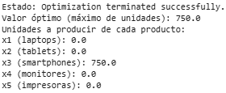

# PREGUNTA 2

## Resolución del problema de Programación Lineal

### a. Preparación del problema primal

Recordemos la forma estándar para el método simplex:

- La función objetivo debe estar en forma de maximización.

- Todas las restricciones deben estar en forma de “≤”.

- Todas las variables deben ser ≥ 0.

Ya lo tenemos en ese formato.

**Variables**

Sea:

    𝑥₁: laptops

    𝑥₂: tablets

    𝑥₃: smartphones

    𝑥₄: monitores

    𝑥₅: impresoras

Agregamos 10 variables de holgura (una por restricción):

    𝑠₁ a 𝑠₅: para restricciones de recursos

    𝑠₆ a 𝑠₁₀: para límites de demanda


**Matriz inicial del Primal**

| BV  | x₁  | x₂  | x₃  | x₄  | x₅  | s₁ | s₂ | s₃ | s₄ | s₅ | s₆ | s₇ | s₈ | s₉ | s₁₀ | RHS    |
| --- | --- | --- | --- | --- | --- | -- | -- | -- | -- | -- | -- | -- | -- | -- | --- | ------ |
| s₁  | 3   | 2   | 1.5 | 4   | 5   | 1  | 0  | 0  | 0  | 0  | 0  | 0  | 0  | 0  | 0   | 3000   |
| s₂  | 6   | 4   | 3   | 5   | 7   | 0  | 1  | 0  | 0  | 0  | 0  | 0  | 0  | 0  | 0   | 2500   |
| s₃  | 2   | 1.5 | 1   | 3   | 2.5 | 0  | 0  | 1  | 0  | 0  | 0  | 0  | 0  | 0  | 0   | 1000   |
| s₄  | 8   | 5   | 3   | 10  | 7   | 0  | 0  | 0  | 1  | 0  | 0  | 0  | 0  | 0  | 0   | 4000   |
| s₅  | 400 | 300 | 200 | 350 | 450 | 0  | 0  | 0  | 0  | 1  | 0  | 0  | 0  | 0  | 0   | 150000 |
| s₆  | 1   | 0   | 0   | 0   | 0   | 0  | 0  | 0  | 0  | 0  | 1  | 0  | 0  | 0  | 0   | 500    |
| s₇  | 0   | 1   | 0   | 0   | 0   | 0  | 0  | 0  | 0  | 0  | 0  | 1  | 0  | 0  | 0   | 800    |
| s₈  | 0   | 0   | 1   | 0   | 0   | 0  | 0  | 0  | 0  | 0  | 0  | 0  | 1  | 0  | 0   | 1200   |
| s₉  | 0   | 0   | 0   | 1   | 0   | 0  | 0  | 0  | 0  | 0  | 0  | 0  | 0  | 1  | 0   | 600    |
| s₁₀ | 0   | 0   | 0   | 0   | 1   | 0  | 0  | 0  | 0  | 0  | 0  | 0  | 0  | 0  | 1   | 700    |
| Z   | -1  | -1  | -1  | -1  | -1  | 0  | 0  | 0  | 0  | 0  | 0  | 0  | 0  | 0  | 0   | 0      |

**Matriz final del Primal**

| BV  | x₁ | x₂ | x₃ | x₄ | x₅ | s₁    | s₂   | s₃   | s₄   | s₅   | s₆ | s₇ | s₈ | s₉ | s₁₀ | RHS  |
| --- | -- | -- | -- | -- | -- | ----- | ---- | ---- | ---- | ---- | -- | -- | -- | -- | --- | ---- |
| x₃  | 0  | 0  | 1  | 0  | 0  | 1.5   | 3    | 1    | 3    | 200  | 0  | 0  | 0  | 0  | 0   | 750  |
| s₁  | 0  | 0  | 0  | 0  | 0  | -1.25 | -2.5 | -0.5 | -2.5 | -100 | 0  | 0  | 0  | 0  | 0   | 1875 |
| s₂  | 0  | 0  | 0  | 0  | 0  | -1.5  | -3   | 0    | -3   | -200 | 0  | 0  | 0  | 0  | 0   | 1250 |
| s₃  | 0  | 0  | 0  | 0  | 0  | -2    | -3   | 0    | -3   | -150 | 0  | 0  | 0  | 0  | 0   | 250  |
| s₄  | 0  | 0  | 0  | 0  | 0  | -1.5  | -3   | 0    | -3   | -150 | 0  | 0  | 0  | 0  | 0   | 1750 |
| s₅  | 0  | 0  | 0  | 0  | 0  | -1.5  | -3   | 0    | -3   | -150 | 0  | 0  | 0  | 0  | 0   | 0    |
| s₆  | 1  | 0  | 0  | 0  | 0  | 0     | 0    | 0    | 0    | 0    | 1  | 0  | 0  | 0  | 0   | 500  |
| s₇  | 0  | 1  | 0  | 0  | 0  | 0     | 0    | 0    | 0    | 0    | 0  | 1  | 0  | 0  | 0   | 800  |
| s₈  | 0  | 0  | 0  | 0  | 0  | 0     | 0    | 1    | 0    | 0    | 0  | 0  | 1  | 0  | 0   | 450  |
| s₉  | 0  | 0  | 0  | 1  | 0  | 0     | 0    | 0    | 0    | 0    | 0  | 0  | 0  | 1  | 0   | 600  |
| s₁₀ | 0  | 0  | 0  | 0  | 1  | 0     | 0    | 0    | 0    | 0    | 0  | 0  | 0  | 0  | 1   | 700  |
| Z   | 0  | 0  | 0  | 0  | 0  | 1.5   | 3    | 1    | 3    | 200  | 0  | 0  | 0  | 0  | 0   | 750  |

### b. Matriz inicial del simplex (tabla simplex del problema primal)

Tendremos una matriz 11x16 (10 restricciones + Z, y 15 columnas para 5 variables + 10 de holgura).

```python
import numpy as np
from scipy.optimize import linprog

# Coeficientes de la función objetivo (maximizar x1 + x2 + x3 + x4 + x5)
# Como linprog minimiza, usamos signos negativos
c = [-1, -1, -1, -1, -1]

# Restricciones del problema (A_ub @ x <= b_ub)
A = [
    [3, 2, 1.5, 4, 5],       # materiales ≤ 3000
    [6, 4, 3, 5, 7],         # horas trabajo ≤ 2500
    [2, 1.5, 1, 3, 2.5],     # ensamblaje ≤ 1000
    [8, 5, 3, 10, 7],        # almacenamiento ≤ 4000
    [400, 300, 200, 350, 450], # presupuesto ≤ 150000
    [1, 0, 0, 0, 0],         # x1 ≤ 500
    [0, 1, 0, 0, 0],         # x2 ≤ 800
    [0, 0, 1, 0, 0],         # x3 ≤ 1200
    [0, 0, 0, 1, 0],         # x4 ≤ 600
    [0, 0, 0, 0, 1],         # x5 ≤ 700
]

b = [3000, 2500, 1000, 4000, 150000, 500, 800, 1200, 600, 700]

# Resolver el problema
res = linprog(c=c, A_ub=A, b_ub=b, method='simplex')

# Resultados
print("Estado:", res.message)
print("Valor óptimo (máximo de unidades):", -res.fun)  # se resta porque c se invirtió
print("Unidades a producir de cada producto:")
print("x1 (laptops):", res.x[0])
print("x2 (tablets):", res.x[1])
print("x3 (smartphones):", res.x[2])
print("x4 (monitores):", res.x[3])
print("x5 (impresoras):", res.x[4])
```

### c. Resultado de la corrida (Primal)

Suponiendo que ejecutamos el código anterior, obtendremos:

---

---